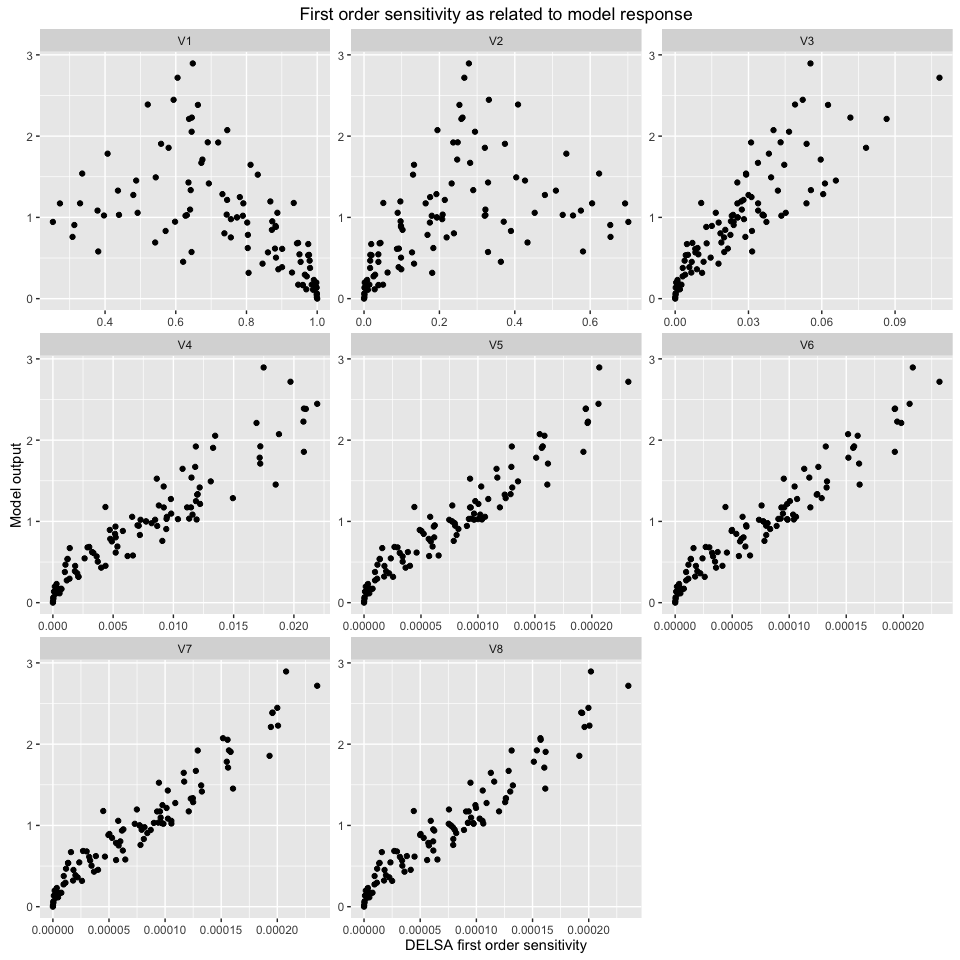
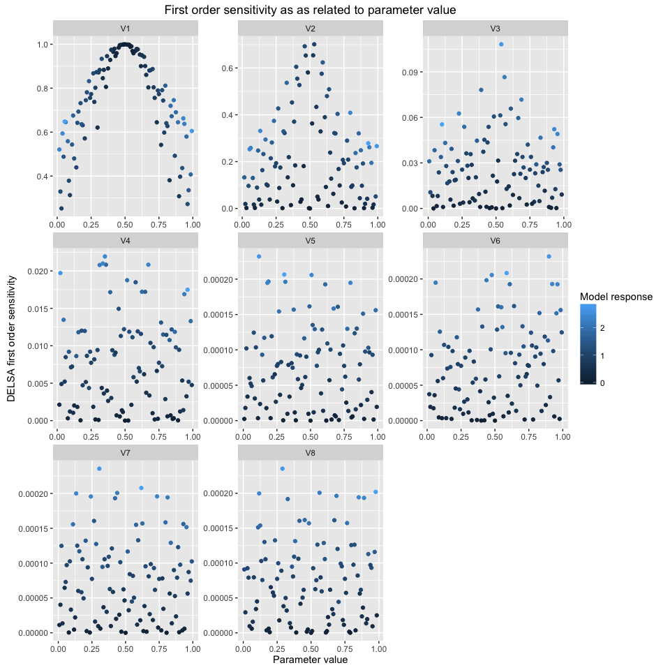

# DELSA
Florian Hartig  
13 Jul 2015  


```r
# Test case : the non-monotonic Sobol g-function
# (there are 8 factors, all following the uniform distribution on [0,1])

## Not run: 
library(sensitivity)
```

```
## Warning: package 'sensitivity' was built under R version 3.1.3
```

```r
library(randtoolbox)
x <- delsa(model=sobol.fun,
           par.ranges=replicate(8,c(0,1),simplify=FALSE),
           samples=100,method="sobol")

# Summary of sensitivity indices of each parameter across parameter space
```


```r
print(x)
```

```
## 
## Call:
## delsa(model = sobol.fun, par.ranges = replicate(8, c(0, 1), simplify = FALSE),     samples = 100, method = "sobol")
## 
## Locations calculated: 100 
## 
## Model runs: 900 
## 
## Summary of first order indices across parameter space:
##        V1               V2                V3                 V4          
##  Min.   :0.2524   Min.   :0.00000   Min.   :0.000000   Min.   :0.000000  
##  1st Qu.:0.6258   1st Qu.:0.04875   1st Qu.:0.006979   1st Qu.:0.002084  
##  Median :0.7772   Median :0.18792   Median :0.023440   Median :0.007074  
##  Mean   :0.7462   Mean   :0.22014   Mean   :0.025711   Mean   :0.007627  
##  3rd Qu.:0.9436   3rd Qu.:0.32380   3rd Qu.:0.036547   3rd Qu.:0.011642  
##  Max.   :1.0000   Max.   :0.70121   Max.   :0.108173   Max.   :0.021933  
##        V5                  V6                  V7           
##  Min.   :0.000e+00   Min.   :0.000e+00   Min.   :0.000e+00  
##  1st Qu.:2.138e-05   1st Qu.:2.138e-05   1st Qu.:2.154e-05  
##  Median :7.015e-05   Median :6.958e-05   Median :6.874e-05  
##  Mean   :7.560e-05   Mean   :7.553e-05   Mean   :7.553e-05  
##  3rd Qu.:1.109e-04   3rd Qu.:1.085e-04   3rd Qu.:1.110e-04  
##  Max.   :2.321e-04   Max.   :2.318e-04   Max.   :2.356e-04  
##        V8           
##  Min.   :0.000e+00  
##  1st Qu.:2.174e-05  
##  Median :7.035e-05  
##  Mean   :7.553e-05  
##  3rd Qu.:1.100e-04  
##  Max.   :2.353e-04
```

```r
library(ggplot2)
```

```
## Warning: package 'ggplot2' was built under R version 3.1.3
```

```r
library(reshape2)
plot(x)
```



