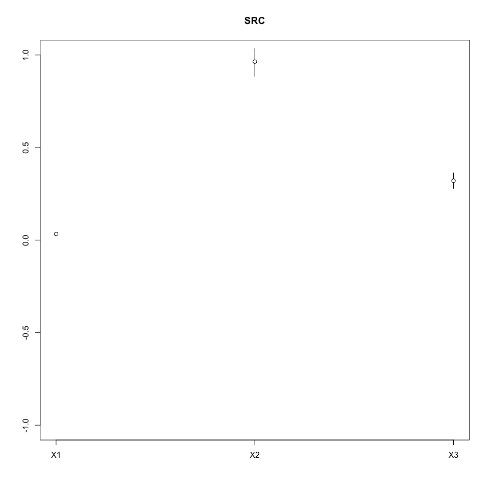
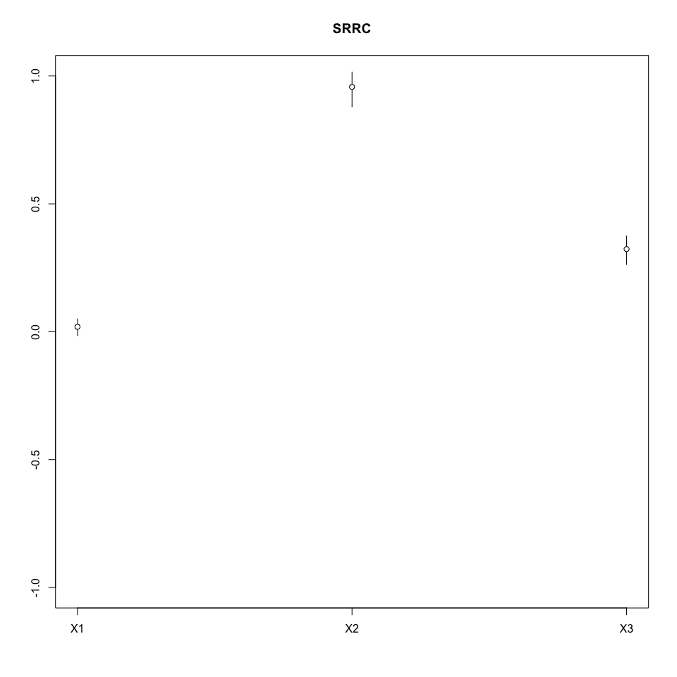

# Sensitivity Coefficients
Florian Hartig  
13 Jul 2015  


```r
rm(list=ls(all=TRUE))

library(sensitivity)
```

```
## Warning: package 'sensitivity' was built under R version 3.1.3
```

```r
# random sample of parameters
n <- 100
X <- data.frame(X1 = runif(n),X2 = runif(n),X3 = runif(n))


# calculate linear model
y <- with(X, 0.1 * X1 + 3 * X2 + 1 * X3)

# src computes the Standardized Regression Coefficients (SRC), or the Standardized Rank Regression Coefficients (SRRC), which are sensitivity indices based on linear or monotonic assumptions in the case of independent factors.

x1 <- src(X, y, nboot = 100, rank = F)
print(x1)
```

```
## 
## Call:
## src(X = X, y = y, rank = F, nboot = 100)
## 
## Standardized Regression Coefficients (SRC):
##      original          bias std. error  min. c.i.  max. c.i.
## X1 0.03353465  0.0003989326 0.00246495 0.02827724 0.03810894
## X2 0.96244401 -0.0016601362 0.03488377 0.88445095 1.03507916
## X3 0.32205972  0.0011985443 0.02175958 0.27891307 0.36278515
```

```r
plot(x1)
```



```r
x2 <- src(X, y, nboot = 100, rank = T)
print(x2)
```

```
## 
## Call:
## src(X = X, y = y, rank = T, nboot = 100)
## 
## Standardized Rank Regression Coefficients (SRRC):
##      original         bias std. error  min. c.i.  max. c.i.
## X1 0.02133993  0.002082230 0.01570724 -0.0155642 0.04995334
## X2 0.95629402 -0.001050484 0.03181903  0.8791063 1.01521398
## X3 0.32155584 -0.001432975 0.02814073  0.2628910 0.37478638
```

```r
plot(x2)
```



